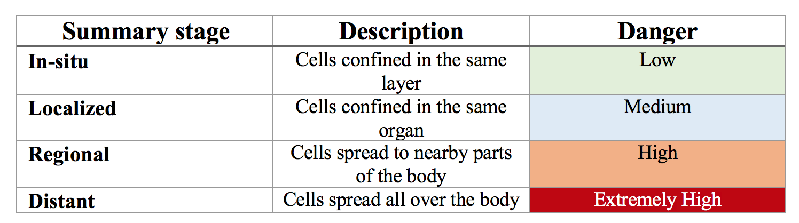
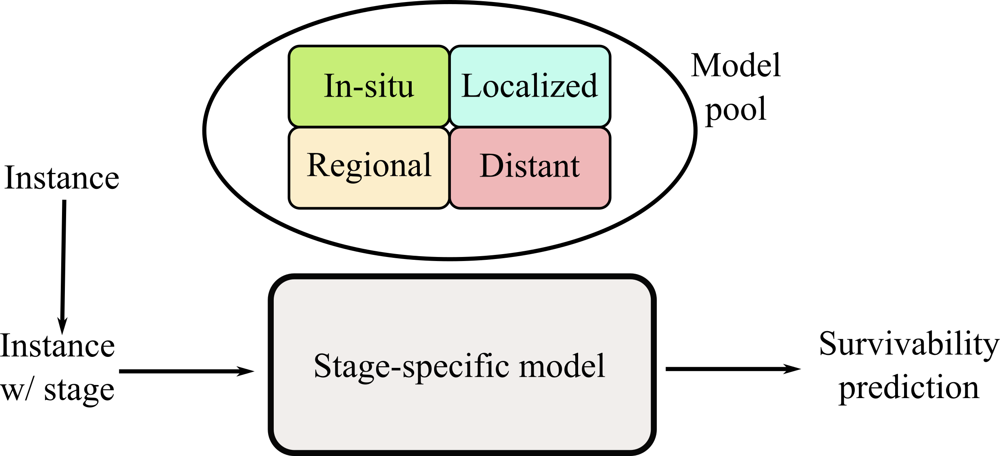
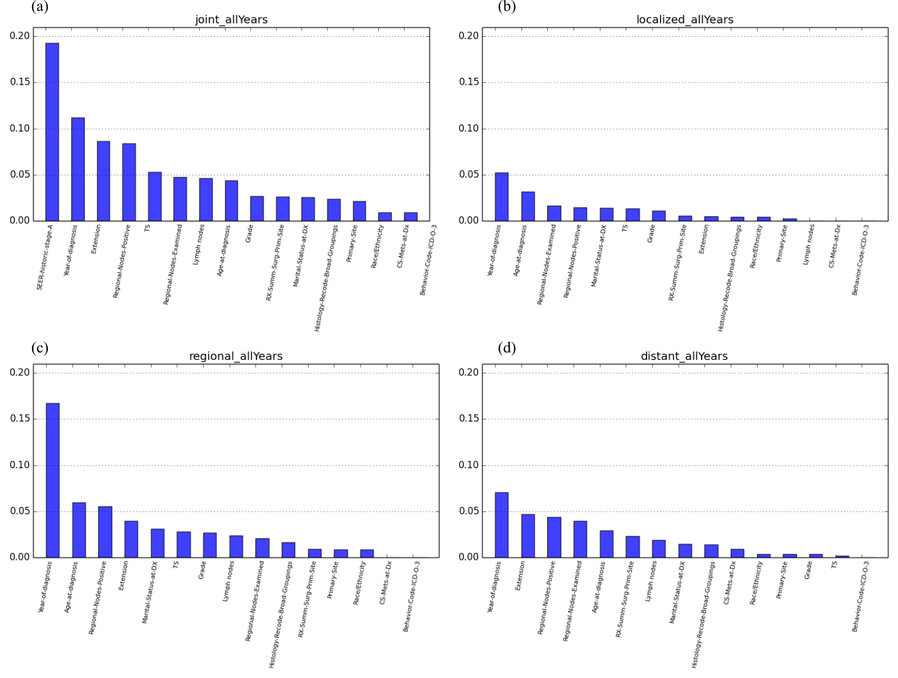
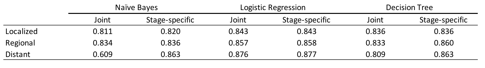

# breastCancerSurvivability project

This repository contains the required programme to replicate my MSc. thesis, *"Stage-specific breast cancer survivability models over time"*, 
in which we explore how stage-specific models are the preferable option when implementing a machine learning-based solution to the problem of predicting breast cancer survivability.

## Installation

This repository is thought as an *Eclipse* project, and thus thought to be run in that environment. The recommended steps if you want to execute the experiments are as follows:

- Download *Eclipse*: [official site](https://www.eclipse.org/), and install the *Java* version.
- Download the Weka package that fits your OS from [here](https://www.cs.waikato.ac.nz/ml/weka/downloading.html). Open the package and look for the main folder *weka*, which will have the form `weka-version`. Within it there should be a file named `weka.jar`. That's the file we are interested in.
- Clone this repo:

```
git clone https://github.com/ricardokleinklein/breastCancerSurvivability.git
```

- Import from *Eclipse* the directory *breastCancerSurvivability* that you have cloned in the previous step.
- `Project Properties --> Java Build Path --> Libraries --> Classpath --> Add External Jar`. Browse to the `weka.jar`mentioned before. Remove the link that may appear. It is linked to my local path and won't work on your machine.
- Open `Dataset.java` and within the `main` method change the path to the dataset. It is a modified version of the [SEER dataset](https://seer.cancer.gov/data/)), so I cannot give access to it. 

*Note:* `resources.zip` contains a draft version of my MSc. Thesis about this set of experiments, but it is not required for anything else. Don't worry about it ;)

## Why stage-specific?

When diagnosed with breast cancer, all patients are given an indicator of hazard of their disease. There are several methods, but the one used in our study (we use the [SEER dataset](https://seer.cancer.gov/data/)) considers four stages:



The survivability on each of these stages is different, and it is a major concern to accurately predict the rate of survivability on each of them so physicians can assess better the treatment and life expectancy of new patients in the future. Traditional machine learning models used to this aim consisted of an unified model in which the summary-stage of the disease was taking into account just like any other feature (or attribute) of a patient.


Our perspective, following (Kate, R.J. and Nadig, R.[https://www.ncbi.nlm.nih.gov/pubmed/27919388] builds a separate model for each summary-stage, solving that way the problem of overstimation that arises in evaluating unified models.



## Main result

First of all, an analysis on the information gain of the attributes we consider in the dataset, we find that summary-stage is the most relevant attribute in discriminating the instance's label (*survived/not survived*). Nonetheless, when performing this same analysis n each sumary stage separately, the year of diagnosis appears as the most important attribute.



This suggests that our hypothesis must remain true not only for the whole of the dataset (data are available from 1973 to 2015), but also in a yearly basis, due to the intrinsic importante of the summary-stage. Our results can be summarized in the following table:



It can be seen that building summary-stage-specific models never worsen the performance of the prediction. On the contrary, it always improves or remains the same.